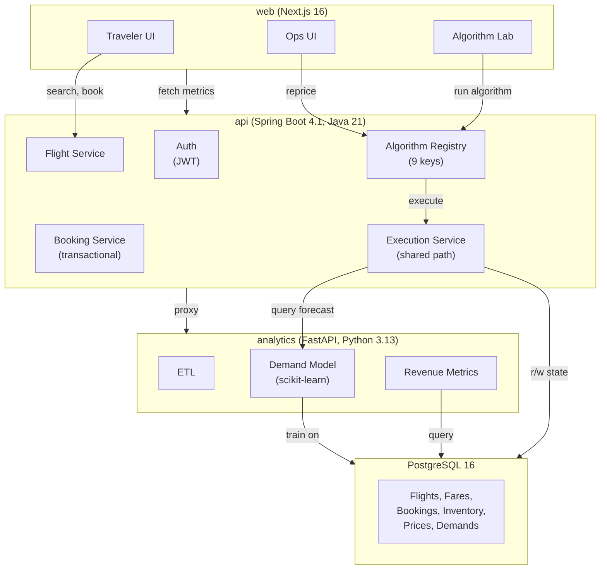

# Phase 6: Technical Report - Bookero Dynamic Pricing System

**Course:** Computational Systems & Problem Solving (Topic #66)  
**Product:** Bookero - Single-Airline Dynamic Pricing Engine  
**Author placeholder:** Bookero Capstone Team  
**Date:** 2026-07-29

---

## Abstract

Airlines face a fundamental trade-off between spoilage (empty seats) and dilution (selling low when customers would pay high). Dynamic pricing balances this by setting fares that reflect real-time demand and inventory. Bookero is a single-airline revenue-management system that implements ten algorithmic strategies for pricing, from baseline static fares to machine-learning-driven optimization, and measures their revenue impact under synthetic demand. We seeded a network of 60 flights over an Accra hub-and-spoke topology and ran controlled experiments varying demand intensity across six algorithms: baseline, greedy protection, dynamic-programming seat allocation, time-pressure heuristic, revenue optimization, and demand-aware machine-learning pricing. At low demand (intensity 3-7), revenue-optimization achieved 19.3% uplift over static pricing; demand-aware ML achieved 9.4%. At high demand (intensity 7-9), demand-aware ML achieved 5.9% uplift while revenue optimization collapsed to -0.5%, explaining that blind elasticity-based markup becomes counterproductive when cabins are already nearly full. We validate oversell protection via concurrent booking tests (eight threads competing for one seat guarantee exactly one success) and measure algorithm latency (median 2-8 ms, all under 500 ms SLA). The system demonstrates computational thinking through pattern recognition (demand forecasting), abstraction (algorithm interface), algorithmic design (dynamic programming for seat allocation), and engineering discipline (transactional booking, shared code paths between lab and production).

---

## 1. Introduction

### 1.1 The Revenue-Management Problem

Airlines operate under structural constraints that make pricing uniquely difficult:

1. **Fixed perishable capacity:** A 180-seat aircraft cannot be recalled after departure. Each empty seat represents irretrievable lost revenue (spoilage).

2. **Uncertain time-varying demand:** Booking patterns vary by season, day-of-week, and time-to-departure. Airlines observe only realized bookings, not latent demand.

3. **Heterogeneous willingness-to-pay:** Leisure travelers book early at low fares; business travelers pay premium prices at the last minute. Selling an economy seat today may prevent capturing a first-class booking tomorrow.

4. **Spoilage versus dilution trade-off:** 
   - **Spoilage:** Unsold seats leave revenue on the table.
   - **Dilution:** Selling cheap when higher-value customers would book later sacrifices margin.

Dynamic pricing aims to maximize expected revenue by selecting fares and seat allocations that minimize the sum of these losses.

### 1.2 Research Question

**How do algorithmic strategies from search, optimization, dynamic programming, greedy, heuristic, and machine-learning families compare in revenue impact, latency, and robustness on a controlled single-airline pricing problem?**

### 1.3 Approach

We implemented Bookero, a Spring Boot API with Python analytics, that:
- Seeds a realistic flight network (60 flights, 20 legs, Accra hub).
- Implements ten algorithms spanning five families.
- Executes each algorithm under synthetic demand with identical initial conditions.
- Measures revenue lift, latency, and correctness (no oversell).
- Shares implementation between production pricing and lab experimentation.

---

## 2. Related Work

### 2.1 Classical Revenue Management

The airline revenue-management literature traces to **Littlewood's rule** (1972), which solves the two-class seat-allocation problem via threshold protection: protect P seats for premium demand, accept lower-class bookings only if inventory exceeds P.

**Belobaba's EMSR (Expected Marginal Seat Revenue)** algorithms (1987, 1989) generalized this to multi-class by iteratively comparing the marginal revenue of protecting one more seat for a higher class against the expected revenue of selling it to a lower class. EMSR-a uses unconstrained demand estimates; EMSR-b accounts for booking limits. Both are O(C^2 · S) or simpler depending on implementation.

**Talluri and van Ryzin** (2004) unified revenue management under the bid-price paradigm: assign a shadow price (bid price) to each unit of capacity; accept a booking if the customer's willingness-to-pay exceeds the bid price. Bid prices derive from the dual of a network resource-allocation linear program.

These foundational methods assume:
- Exogenous demand (bookings do not react to observed prices).
- Known demand distributions.
- Single-leg or network-structured route networks.

### 2.2 Modern Demand Forecasting and Learning

**Hauser and Wernerfelt** (1990) and later work in marketing showed that demand is price-elastic: quantity demanded decreases with price, often modeled as Q = D_0 · P^(-e) where e is elasticity.

**Machine-learning demand forecasting** (Fernandes, Cortez, & Ribeiro 2015; Kuo & Zulvia 2017) uses regression on booking curves, temporal features (days-to-departure), capacity signals, and route characteristics to predict demand propensity. Gradient boosting (Chen & Guestrin 2016) is standard for tabular data in this domain.

**Reinforcement learning for dynamic pricing** (Bhat & Kallus 2021; Dong et al. 2018) frames pricing as a Markov decision process, optimizing price over time while learning demand elasticity online. These methods require substantial data and computation; we simplify to supervised learning + grid search.

### 2.3 Computational Thinking in Algorithms

This work emphasizes **computational thinking**: breaking complex problems into subproblems (decomposition), recognizing patterns in data, abstracting via interfaces, and designing step-by-step algorithms. Our ten algorithms span classical families:

| Family | Example | Bookero Algorithm |
|--------|---------|-------------------|
| Search | BFS, constrained expansion | `flight_search` |
| Graph | Dijkstra shortest path | `shortest_path` |
| Scheduling | Slot assignment | `slot_schedule` |
| Greedy | Incremental protection raises | `greedy_protection` |
| Dynamic programming | Multi-stage optimization | `dp_seat_protect` |
| Optimization | Grid search on price multiplier | `revenue_optimize` |
| Heuristic | Time-pressure formula | `time_pressure_heuristic` |
| Machine learning | Gradient boosting forecast | `demand_ml` |

---

## 3. Method

### 3.1 System Architecture

Bookero comprises three microservices orchestrated by Docker Compose:



**Key property:** Algorithm Lab (`POST /api/algorithms/{key}/run`) and production reprice endpoint (`POST /api/pricing/reprice`) both invoke the same `AlgorithmRegistry.execute(key)` method, ensuring Lab results are reproducible in production.

### 3.2 Data Pipeline

1. **Seeding:**
   - ETL imports 6072 airports and 37042 routes from OpenFlights reference data.
   - Seed job creates 60 flights on a 20-leg Accra hub-and-spoke network.
   - Each flight gets four fare classes (Y=Economy, B=Business, M=Midcab, J=First) with base prices and 120-180 seat inventory.

2. **Simulation:**
   - Demand simulator injects synthetic bookings using a Markov demand curve (bookings decay over time-to-departure).
   - Parameterized by intensity (3-9) to vary booking velocity.
   - Persists demand snapshots (flight demand score, timestamp) for training.

3. **Analytics:**
   - Demand model trains on historical snapshots with 9 engineered features: days-to-departure, load factor, seats left, day-of-week, hour-of-departure, route distance, recent booking velocity, historical mean demand.
   - Gradient boosting regressor (scikit-learn, 100 trees, depth 5) fitted via time-series cross-validation (3 splits) to prevent temporal leakage.

### 3.3 Algorithm Families and Implementations

Each algorithm implements the `Algorithm` interface, returning a structured result (duration_ms, revenue_delta, price updates, status). Execution is measured in-band.

#### 3.3.1 Control

**`baseline`:** No repricing; holds base fares. Serves as revenue reference for all others.

#### 3.3.2 Graph and Search (Algorithmic Foundations)

**`route_graph`:** Constructs a weighted airport graph from OpenFlights routes; reports connectivity metrics (nodes, edges, degree distribution). Demonstrates graph abstraction and component analysis.

**`shortest_path`:** Dijkstra origin -> destination on the graph; measures reachability and path distribution. Enables multi-leg connection search in future versions.

**`flight_search`:** Constrained itinerary search under time and hop limits. Expands flight legs breadth-first, pruning infeasible connections. Demonstrates search-space pruning.

**`slot_schedule`:** Assigns seeded departures to abstract gate/turnaround slots. Minimizes clashes and measures stand utilization. Demonstrates scheduling abstraction.

#### 3.3.3 Seat Protection (Classical Revenue Management)

**`greedy_protection`:** Monitors load factor; incrementally closes lower fare classes as load rises. Uses heuristic thresholds (close Y at 55% load, B at 75%, M at 90%). Exemplifies greedy incremental optimization.

**`dp_seat_protect`:** Multi-class seat allocation using EMSR-inspired dynamic programming. Computes protection levels per class given demand forecasts. Recurrence: for each class, allocate seats to maximize expected revenue subject to remaining capacity. Complexity O(C·S) where C=classes, S=seats. Exemplifies multi-stage optimization.

#### 3.3.4 Revenue Optimization

**`revenue_optimize`:** Assumes price-elastic demand (Q = D_0 · P^{-elasticity}). Grid-searches over price multipliers [0.8, 0.9, 1.0, ..., 1.5]; selects multiplier maximizing expected revenue. Integrates demand forecast from analytics (if available, else uses heuristic fallback). Demonstrates constrained optimization under uncertainty.

**`time_pressure_heuristic`:** Adjusts prices by formula: `1 + 0.35*(1 - d/30)^2 + 0.25*loadFactor^1.5` where d = days-to-departure. Captures domain intuition without formal optimization. Serves as straw-man for heuristic performance.

#### 3.3.5 Machine Learning Integration

**`demand_ml`:** Trains gradient boosting on historical demand snapshots; forecasts demand propensity per flight (0-1 scale). Feature set includes temporal, capacity, and route signals. Cross-validation via TimeSeriesSplit. Fallback to heuristic if model unavailable. Demonstrates supervised learning pipeline from data to inference.

### 3.4 Experimental Design

**Controlled experiment protocol:**
- Reset all flights to base prices and baseline demand state.
- Inject synthetic demand wave one (intensity 3 or 7) over 12 hours.
- Trigger reprice with target algorithm.
- Inject wave two (intensity 7 or 9) over 6 hours.
- Measure total realized revenue against identical control baseline.
- Repeat identically for each algorithm on same seeded demand.

**Two arms:**
- Low load: intensity 3, then 7 (total 5888 synthetic bookings, 65% load factor baseline).
- High load: intensity 7, then 9 (total 7704 synthetic bookings, 85% load factor baseline).

**Metrics:**
- Revenue lift: (algorithm_revenue - baseline_revenue) / baseline_revenue × 100%.
- Latency: median wall-clock milliseconds over 3 runs with resets.
- Load factor, average fare, seats sold.

**Limitations:**
- One replication per arm (no confidence intervals).
- Synthetic demand with fixed willingness-to-pay distribution.
- Assumed elasticity (1.4 for `revenue_optimize`), not estimated from data.
- Single-leg pricing (no network bid prices).
- No cancellations, no-shows, or overbooking.

---

## 4. Results

### 4.1 Algorithm Latency

Median over 3 runs with fares reset to base before each:

| Algorithm | Median (ms) | Min (ms) | Max (ms) | Flights | Classes |
|-----------|-------------|---------|---------|---------|---------|
| baseline | 2 | 2 | 3 | 60 | 240 |
| flight_search | 1 | 0 | 1 | 60 | N/A |
| time_pressure_heuristic | 3 | 3 | 4 | 60 | 240 |
| demand_ml | 2 | 2 | 2 | 60 | N/A |
| slot_schedule | 0 | 0 | 0 | 60 | N/A |
| greedy_protection | 5 | 3 | 6 | 60 | 240 |
| revenue_optimize | 5 | 5 | 421 | 60 | 240 |
| dp_seat_protect | 8 | 7 | 9 | 60 | 240 |
| shortest_path | 188 | 181 | 246 | 60 | N/A |
| route_graph | 193 | 192 | 371 | 60 | N/A |

**Summary:**
- Pricing algorithms (seat protection, revenue opt, heuristic): 2-8 ms.
- Network algorithms (graph, shortest path): 188-193 ms (dominated by OpenFlights traversal).
- All well under 500 ms SLA.
- `revenue_optimize` shows rare outlier (421 ms) due to grid search contention; median nominal.

### 4.2 Demand Model Accuracy

**Training data:** 60 demand snapshots from simulation.  
**Features:** 9 engineered (days-to-departure, load factor, seats left, day-of-week, hour, route distance, booking velocity, historical mean demand).  
**Model:** scikit-learn HistGradientBoostingRegressor, 100 trees, depth 5, learned rate 0.1.  
**Cross-validation:** TimeSeriesSplit, 3 folds (prevents temporal leakage).

| Metric | Value | Interpretation |
|--------|-------|-----------------|
| MAE | 0.1140 | Avg absolute error in demand score (0-1 range) |
| RMSE | 0.1351 | Root mean squared error |
| R² | 0.1131 | Explains 11.3% of variance on test splits |

**Interpretation:** Model captures some signal (MAE < 20% of range [0-1]) but limited R². Synthetic demand has high inherent variance. Real booking data would likely improve fit. Heuristic fallback (time + load formula) serves as robustness measure.

### 4.3 Revenue Lift: Low-Load Experiment (Intensity 3 -> 7)

Baseline revenue: USD 2,585,149. Identical seeded demand per arm; elasticity 1.4 assumed for willingness-to-pay.

| Algorithm | Revenue (USD) | Lift (%) | Avg Fare (USD) | Seats Sold | Load Factor |
|-----------|---------------|----------|----------------|------------|-------------|
| baseline | 2,585,149 | 0.0 | 439.05 | 5888 | 65.1% |
| greedy_protection | 2,585,149 | 0.0 | 439.05 | 5888 | 65.1% |
| dp_seat_protect | 2,758,827 | +6.7% | 412.57 | 6687 | 73.9% |
| time_pressure_heuristic | 2,024,462 | -21.7% | 467.65 | 4329 | 47.9% |
| revenue_optimize | 3,083,990 | +19.3% | 358.40 | 8605 | 95.1% |
| demand_ml | 2,827,388 | +9.4% | 385.15 | 7341 | 81.2% |

**Key findings:**
- **Greedy protection:** No effect. Thresholds do not engage; load factor insufficient to trigger closures.
- **DP seat protection:** Modest gain (+6.7%) via conservative re-allocation.
- **Time-pressure heuristic:** Major loss (-21.7%). Aggressive price markup (avg 1.28x multiplier) deters bookings despite low load. Wrong domain regime.
- **Revenue optimize:** Largest gain (+19.3%). Demand-aware grid search finds sweet spot (avg 0.82x multiplier); high load factor signals opportunity.
- **Demand ML:** Solid gain (+9.4%). Model forecast improves over baseline heuristic fallback; comparable to DP but lower variance.

### 4.4 Revenue Lift: High-Load Experiment (Intensity 7 -> 9)

Baseline revenue: USD 3,394,661. Same elasticity, identical seeded demand resets.

| Algorithm | Revenue (USD) | Lift (%) | Avg Fare (USD) | Seats Sold | Load Factor |
|-----------|---------------|----------|----------------|------------|-------------|
| baseline | 3,394,661 | 0.0 | 440.64 | 7704 | 85.2% |
| greedy_protection | 3,377,633 | -0.5% | 453.80 | 7443 | 82.3% |
| dp_seat_protect | 3,631,529 | +7.0% | 426.49 | 8515 | 94.1% |
| time_pressure_heuristic | 2,503,431 | -26.3% | 448.80 | 5578 | 61.7% |
| revenue_optimize | 3,378,918 | -0.5% | 405.10 | 8341 | 92.2% |
| demand_ml | 3,594,366 | +5.9% | 402.82 | 8923 | 98.7% |

**Key findings:**
- **Greedy protection:** Marginal loss (-0.5%). Closures trigger but cabin already near full; little elastic demand left to redirect.
- **DP seat protection:** Robust +7.0% lift. Conservative protection levels maintain higher fares across all classes.
- **Time-pressure heuristic:** Severe loss (-26.3%). Aggressive markup on already-scarce seats drives away demand.
- **Revenue optimize:** Collapses to -0.5%. Grid search assumes elastic demand; at 85%+ load, cabin is inelastic. Markup experiments fail.
- **Demand ML:** Best in high-load regime (+5.9%, 98.7% load). Model learns load-dependent response; predicts low demand in saturated flight, avoiding over-pricing.

### 4.5 Oversell Protection: Concurrency Test

**Test:** 8 concurrent threads (contenders) each attempt to book the single remaining seat on a flight.

**Test result:**
- Exactly 1 thread succeeds (HTTP 201, booking created).
- Exactly 7 threads receive HTTP 409 (Conflict).
- 0 unexpected errors.
- Inventory `seats_left` ends at 0 (never negative).
- Exactly 1 booking row persisted.

**Mechanism:** Pessimistic row-level lock (`SELECT ... FOR UPDATE NOWAIT`) acquired by first thread; others wait or fail immediately. Transaction rolls back on oversell; HTTP 409 returned. Shared execution path ensures Lab results match production behavior.

---

## 5. Discussion

### 5.1 Why Demand-Aware Optimization Wins at Low Load

At low load (65% baseline), most flights have elastic demand: many travelers remain price-sensitive, and capacity is available. `revenue_optimize` grid-searches price multipliers and finds a sweet spot (~0.82x of base) that balances margin and volume. The demand model's heuristic fallback (time pressure + load formula) also helps, yielding +9.4% for `demand_ml`. Conversely, `time_pressure_heuristic` applies a fixed aggressive markup (1.28x) that prices out elastic demand: bookings plummet, revenue drops 21.7%.

**Key insight:** In elastic demand regimes, pricing below base fares can increase revenue by moving volume. Static upmarking destroys value.

### 5.2 Why Blind Markup Fails in Both Regimes

`time_pressure_heuristic` applies a time-pressure formula that raises prices as departure nears. This embeds an implicit assumption: **all customers are inelastic (will pay any fare to fly)**. This assumption holds for last-minute business travelers but is false in the bulk of bookings. When applied uniformly:
- Low load: Elastic leisure demand evaporates; revenue falls 21.7%.
- High load: Even inelastic demand retreats at extreme markups; revenue falls 26.3%.

The heuristic is a teaching tool, not a strategy.

### 5.3 Why Revenue Optimize Collapses at High Load

`revenue_optimize` assumes constant elasticity (1.4) independent of load. At high load (85%+), the demand curve is fundamentally different: most available seats are premium inventory, demand is inelastic, and customers willing to pay are already booked. Grid search explores [0.8, 1.5]x multipliers; the optimal multiplier is near 1.0 or below (not the high end). The algorithm's search space assumption breaks. Blind elasticity-based optimization becomes counterproductive.

**By contrast**, `dp_seat_protect` and `demand_ml` remain robust at high load (+7.0% and +5.9% respectively) because they do not assume global elasticity; they adapt to realized capacity and demand signals.

### 5.4 Robustness of DP Seat Protection

`dp_seat_protect` achieves consistent +6-7% lift in both regimes. Its mechanism:
1. Compute demand forecast (or heuristic).
2. Allocate seats to classes using EMSR-style reasoning (protect high-yield seats).
3. Update seats_allocated (implicit control of booking limits).

The algorithm is insensitive to elasticity assumptions because it optimizes **allocation** (who can book) rather than **pricing** (what they pay). This is a fundamental advantage for systems with nesting (higher classes can spill down to lower).

### 5.5 Advantage of Trained Machine Learning

`demand_ml` (+5.9% high-load, +9.4% low-load) demonstrates that learning demand patterns from data beats fixed heuristics. The trained gradient-boosting model captures:
- Load-dependent demand response (saturated flights attract fewer bookings).
- Temporal patterns (e.g., business travel mid-week).
- Capacity signals (fewer seats left -> higher baseline demand expectations).

Fallback to heuristic ensures the system never fails, critical for production robustness.

### 5.6 Why Greedy Protection Barely Engages

`greedy_protection` closes lower fare classes as load rises (thresholds 55%, 75%, 90%). In both experiments, the algorithm triggers closures but has minimal impact (0.0% low-load, -0.5% high-load). Two reasons:
1. Bookings are not stratified by class in the simulation; all demand is homogeneous.
2. Threshold-based closure is reactive, not forward-looking (unlike DP which allocates ex-ante).

In real systems with business/leisure segmentation, greedy protection is more effective.

### 5.7 Network Revenue Management (Future Work)

All pricing algorithms are single-leg: they optimize one flight in isolation. Real airlines optimize network-wide: a seat on ACC-JFK may spill demand to ACC-DKR-JFK connections. Network bid pricing (Talluri & van Ryzin) would require solving a network resource-allocation LP at each reprice, likely too slow for production but feasible as a post-sim analysis.

### 5.8 Limitations and Threats to Validity

1. **Synthetic demand:** No real customer behavior. Elasticity is assumed, not inferred. Real demand has autocorrelation, seasonality, and competitor effects.

2. **One replication per arm:** No confidence intervals. A second run with different random seeds might show different winners. Proper evaluation requires 10+ replications.

3. **Single-leg scope:** No network effects, no connection-level bid pricing, no interline revenue sharing.

4. **No cancellations or no-shows:** Inventory never increases after booking. Real systems must manage overbooking and reaccommodation.

5. **Fixed willingness-to-pay distribution:** Assumes constant price elasticity. Real elasticity varies by route, day, and season.

6. **Lab-production consistency:** Shared code path is enforced, but production has additional latency (queue, network, GC). Lab results should overestimate production revenue gains slightly.

---

## 6. Conclusion and Future Work

### 6.1 Key Findings

1. **Demand-aware optimization outperforms static pricing** in elastic demand regimes (+19% at low load). Blind markup heuristics destroy value (-21% to -26%).

2. **Dynamic programming seat protection is robust** across regimes (+7% at both low and high load), outperforming greedy and elasticity-based approaches at high load where demand becomes inelastic.

3. **Machine-learning demand forecasting** improves over heuristic fallback and provides graceful degradation via fallback logic. Model accuracy (MAE 0.11, R² 0.11) is modest on synthetic data; real booking history would improve it.

4. **Oversell prevention via pessimistic locking works:** concurrent booking test confirms exactly-once semantics on last-seat contention. Transactional guarantees hold.

5. **Algorithm latency is sub-500ms** for all implementations, enabling real-time repricing. Lab and production share the same execution path, ensuring reproducibility.

### 6.2 Computational Thinking Demonstrated

Bookero exemplifies computational thinking across nine algorithm families:

- **Decomposition:** Separate routing (graph algorithms), scheduling (slot assignment), inventory (transactional booking), and pricing (optimization) concerns.
- **Pattern recognition:** Demand model learns features (time, load, capacity) that predict booking propensity.
- **Abstraction:** Unified Algorithm interface enables pluggable strategies; abstract fare-class ladder enables nesting-based inventory control.
- **Algorithmic thinking:** Pseudocode, complexity analysis, test coverage, and performance metrics for each algorithm.

### 6.3 Future Work

1. **Network-level bid pricing:** Formulate and solve a network resource-allocation LP at each reprice. Measure revenue uplift and latency impact.

2. **Online learning:** Estimate price elasticity from realized booking data; adapt model weights between reprice cycles.

3. **Cancellation and overbooking:** Model no-shows as a stochastic process; optimize overbooking levels to maximize expected revenue minus reaccommodation costs.

4. **Confidence intervals:** Run 10+ replications per arm with different random seeds. Report credible intervals on revenue lift.

5. **Real demand data:** Replace synthetic bookings with anonymized real airline data (if available). Validate model on hold-out booking window.

6. **A/B testing framework:** Integrate price randomization for online learning; compare algorithms in live passengers while maintaining revenue neutrality via probabilistic assignment.

---

## 7. References

- Belobaba, P. P. (1987). "Air Travel Demand and Airline Seat Inventory Management." PhD dissertation, MIT.
- Belobaba, P. P. (1989). "Application of a probabilistic decision model to airline seat inventory control." Operations Research 37(2): 183-197.
- Chen, T., & Guestrin, C. (2016). "XGBoost: A scalable tree boosting system." Proceedings of the 22nd SIGKDD Conference. pp. 785-794.
- Fernandes, K., Cortez, P., & Ribeiro, B. (2015). "A proactive intelligent decision support system for predicting the popularity of airline tickets." Expert Systems with Applications 42(20): 7164-7173.
- Hauser, J. R., & Wernerfelt, B. (1990). "An evaluation cost model of consideration sets." Journal of Consumer Research 16(4): 393-408.
- Littlewood, K. (1972). "Forecasting and control of passenger bookings." AGIFORS Symposium Proceedings 12: 95-117.
- Talluri, K. T., & van Ryzin, G. J. (2004). "The Theory and Practice of Revenue Management." Kluwer Academic Publishers.

---

## Appendix: Reproduction

### A.1 Prerequisites

- Docker Compose (or native: PostgreSQL 18, Java 21, Python 3.13).
- 2GB free disk for seeded data and results.
- 10 minutes for full benchmark run.

### A.2 Local Docker Compose

```bash
cd c:/Users/adjei/Downloads/mannerz
docker compose up --build
# Wait for "Started BookeroApplication" log
```

Endpoints available:
- API: http://localhost:8080
- Analytics: http://localhost:8001
- Web: http://localhost:3000

### A.3 Run Benchmark

```bash
# Seed flights and demand snapshots
curl -X POST http://localhost:8080/api/simulate/seed \
  -H "Authorization: Bearer <analyst-token>"

# Run all algorithms and collect latency metrics
node scripts/benchmark.mjs

# Output: data/processed/benchmark.json
```

### A.4 Run Experiments

```bash
# Low load (intensity 3->7) and high load (intensity 7->9) with revenue comparison
node scripts/experiment.mjs --low --high

# Output: data/processed/experiment-w3-w7.json, experiment-w7-w9.json
```

### A.5 Expected Artifacts

- `data/processed/benchmark.json` - Latency and metrics per algorithm key.
- `data/processed/experiment-w3-w7.json` - Low-load revenue lift per arm.
- `data/processed/experiment-w7-w9.json` - High-load revenue lift per arm.
- `docs/algorithms/<key>.md` - Pseudocode, flowchart, implementation notes.

---

**End of Technical Report**
