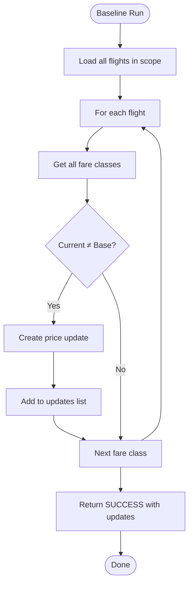

# Algorithm: `baseline`

**Family:** Control  
**Purpose:** Serve as the experimental control group by resetting all fares to base price.

## Purpose

Revenue management experiments require a control treatment. The `baseline` algorithm resets all in-scope fares to their `base_price`, eliminating dynamic pricing and revealing what revenue would be under static pricing. Analysts use this as the baseline to measure how much each dynamic algorithm improves (or worsens) revenue.

## Inputs / Outputs

| Item | Type | Purpose |
|------|------|---------|
| **Input** | Flights in scope (via `AlgorithmContext`) | Flight IDs and fare classes to reprice |
| **Input** | Fare class data | Current and base prices |
| **Output** | `priceUpdates: List<PriceUpdate>` | One update per fare class that needs resetting |
| **Output** | `revenueDelta` | 0 (no markup applied) |
| **Output** | `metrics.faresReset` | Count of fares modified |

## Pseudocode

```
FUNCTION baseline_execute(context):
  priceUpdates := []
  
  FOR EACH flightId IN context.flightIds:
    fareClasses := context.getFareClasses(flightId)
    
    FOR EACH fareClass IN fareClasses:
      IF fareClass.currentPrice != fareClass.basePrice:
        priceUpdates.append({
          flightId: flightId,
          fareClassCode: fareClass.code,
          oldPrice: fareClass.currentPrice,
          newPrice: fareClass.basePrice
        })
  
  RETURN {
    status: "SUCCESS",
    durationMs: 0,
    revenueDelta: 0,
    priceUpdates: priceUpdates,
    flightsAffected: len(context.flightIds),
    metrics: {
      faresReset: len(priceUpdates)
    }
  }
```

## Mermaid Flowchart



## Complexity Analysis

- **Time Complexity:** O(F) where F = total fare classes across all flights. One pass through each fare class.
- **Space Complexity:** O(U) where U = number of price updates (fare classes not at base price). Worst case O(F).

## Design Rationale

The baseline control is essential for rigorous algorithm evaluation. It answers: "How much incremental revenue does dynamic pricing generate versus static pricing?" Without a control, evaluators cannot assess algorithm quality. We use base price (not random or fixed price) as the control because:

1. **Fairness:** Base price is the intended normal fare; it represents a neutral, non-optimized state.
2. **Reproducibility:** Base prices are stable and fixed per flight class.
3. **Interpretability:** Revenue delta vs. baseline is intuitive to stakeholders.

**Alternatives considered:**
- Random prices per class → too noisy; poor reproducibility
- Previous day's price → not available in simulation; couples evaluation to history
- Zero markup (all classes same price) → unrealistic; not how airlines price

## Implementation

**Class:** `com.bookero.algorithms.BaselineAlgorithm`  
**Location:** `services/api/src/main/java/com/bookero/algorithms/BaselineAlgorithm.java`

```java
@Component
public class BaselineAlgorithm implements Algorithm {
  @Override
  public String key() { return "baseline"; }
  
  @Override
  public String family() { return "Control"; }
  
  @Override
  public AlgorithmResult execute(AlgorithmContext ctx) {
    // Reset all fares to base_price; track updates
  }
}
```

## Tests

**Test class:** `com.bookero.algorithms.BaselineAlgorithmTest`

**Assertions:**
- `baseline` key and family are correct
- Description contains "base price"
- When executed, returns non-null `AlgorithmResult`
- When prices differ from base, `priceUpdates.size() > 0`

## Performance Results

| Metric | Benchmark (ms) | Low Load (w3-w7) | High Load (w7-w9) |
|--------|---:|---:|---:|
| Duration | 2 (median) | N/A | N/A |
| Duration range | 2-3 ms | N/A | N/A |
| Fares moved | 0 | 0 | 0 |
| Revenue (absolute) | N/A | 2,585,148.60 | 3,394,661.04 |
| Revenue delta | 0.00% | control | control |
| Load factor | 45.4% | 65.1% | 85.2% |
| Avg fare | 448.26 | 439.05 | 440.64 |
| Seats sold | 4,110 | 5,888 | 7,704 |

**Notes:**
- Baseline is the control group: all fares reset to base price.
- Latency is near-zero (O(F·C) scan through fare classes; no optimization).
- Revenue delta is 0 by design (control treatment).
- Baseline revenue in experiments reflects actual bookings at list prices; used to compute lift for other algorithms.
