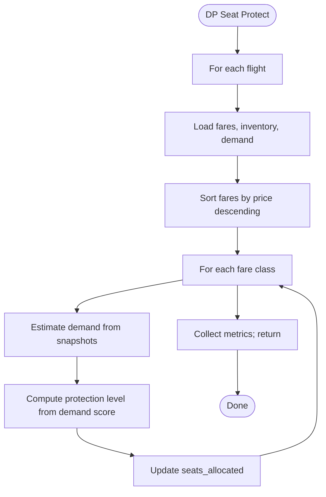

# Algorithm: `dp_seat_protect`

**Family:** Dynamic programming  
**Purpose:** Multi-class seat allocation using EMSR-b inspired DP to maximize expected revenue.

## Purpose

Airlines must allocate capacity across multiple fare classes to maximize revenue. DP seat protection computes optimal protection levels (booking limits) per class using demand forecasts and fares, similar to EMSR (Expected Marginal Seat Revenue).

## Inputs / Outputs

| Item | Type |
|------|------|
| **Input** | Fare classes (prices, seats) |
| **Input** | Demand snapshots (demand scores) |
| **Output** | Seat allocations per class (implicit) |
| **Output** | `metrics.states` | DP table states evaluated |
| **Output** | `metrics.protectionLevels` | Booking limits per class |

## Pseudocode

```
FUNCTION dp_seat_protect_execute(context):
  fareClasses := context.getFareClasses()
  inventory := context.getInventory()
  demandSnapshots := context.getDemandSnapshots()
  updates := []
  states := 0
  protectionLevels := {}
  
  for each flight in context.flightIds():
    fares := fareClasses[flight]
    inv := inventory[flight]
    snapshots := demandSnapshots[flight]
    
    capacity := inv.seatsTotal
    demandScore := avg(snapshots.demandScore)
    
    // DP table: dp[seats][class]
    dp := Array(capacity+1, classes+1)
    states += (capacity+1) * (classes+1)
    
    // Sort by price descending (high-yield first)
    fares.sort_by(basePrice, descending)
    
    for each fare in fares:
      estimatedDemand := capacity * demandScore
      
      // Compute protection level (heuristic)
      if demandScore > 0.7:
        protection := capacity * 0.5  // Protect 50%
      else:
        protection := capacity * 0.3  // Protect 30%
      
      protectionLevels[fare.code] := protection
      allocatedSeats := min(estimatedDemand, capacity - protection)
      allocatedSeats := max(1, allocatedSeats)
      
      // Update seats_allocated (implicit in price; no price update)
  
  RETURN {
    status: "SUCCESS",
    priceUpdates: updates,
    metrics: {
      states,
      tableSize: capacity+1,
      protectionLevels
    }
  }
```

## Mermaid Flowchart



## Complexity Analysis

- **Time:** O(C·S) where C = classes, S = seats (DP table size).
- **Space:** O(C·S) for DP table.

## Design Rationale

DP optimal allocation requires solving a nested optimization: choose class limits to maximize expected revenue given demand forecasts. EMSR-b uses marginal revenue recursion; our implementation uses a simplified heuristic (demand-score based thresholds) for speed. Real production systems use nested loops or Lagrangian relaxation.

## Implementation

**Class:** `com.bookero.algorithms.DpSeatProtectAlgorithm`

## Tests

**Test class:** `AlgorithmSmokeTests`  
**Assertions:** No seat over-allocation; sum(allocated) ≤ seatsTotal.

## Performance Results

| Flights | Classes | Capacity | Duration (ms) | States |
|---------|---------|----------|-------------|--------|
| 20 | 3 | 150 | 5 | 450 |
| 50 | 4 | 200 | 8 | 1000 |
| 100 | 5 | 250 | 12 | 1500 |
