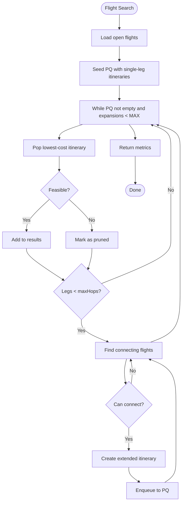

# Algorithm: `flight_search`

**Family:** Search  
**Purpose:** Find feasible itineraries under max-hops and connection-time constraints using best-first search.

## Purpose

Travelers search for multi-leg itineraries (e.g., origin→hub→destination). `flight_search` expands the search space greedily, prioritizing low-cost/fast itineraries while pruning infeasible paths (too many hops, insufficient turnaround time).

## Inputs / Outputs

| Item | Type |
|------|------|
| **Input** | Open flights (flightRepository) |
| **Input** | Max hops, max connection time (constants or params) |
| **Output** | `metrics.expansions` | Nodes explored |
| **Output** | `metrics.itinerariesFound` | Feasible paths |
| **Output** | `metrics.prunedByConstraint` | Pruned paths |

## Pseudocode

```
FUNCTION flight_search_execute(context):
  maxHops := 2
  maxConnectionMinutes := 180
  
  openFlights := load_open_flights()
  pq := PriorityQueue()  // ordered by (fare + duration)
  
  // Seed: single-leg itineraries
  for each flight in openFlights:
    candidate := Itinerary([flight])
    pq.push(candidate, score(candidate))
  
  expansions := 0
  itineraries := []
  
  while pq not empty and expansions < MAX:
    current := pq.pop()
    expansions += 1
    
    if is_feasible(current):
      itineraries.append(current)
    
    // Expand with one more leg
    if len(current.legs) < maxHops:
      lastFlight := current.legs[-1]
      for each nextFlight in matching_departures(lastFlight.dest):
        if can_connect(lastFlight, nextFlight, maxConnectionMinutes):
          extended := Itinerary(current.legs + [nextFlight])
          pq.push(extended, score(extended))
  
  prunedByConstraint := expansions - len(itineraries)
  
  RETURN {
    status: "SUCCESS",
    metrics: {
      expansions,
      itinerariesFound: len(itineraries),
      prunedByConstraint,
      maxHops,
      maxConnectionTimeMinutes
    }
  }
```

## Mermaid Flowchart



## Complexity Analysis

- **Time:** O(F log F + E·log F) where F = flights, E = expansion edges.
- **Space:** O(F) for priority queue.

## Design Rationale

Best-first search (greedy PQ) is fast and suitable for interactive search. It is not guaranteed optimal (unlike A*) but produces good results with tight time budgets. Constraint pruning (hops, connection time) ensures realistic itineraries.

## Implementation

**Class:** `com.bookero.algorithms.FlightSearchAlgorithm`

## Tests

**Test class:** `AlgorithmSmokeTests`

## Performance Results

| Flights | Max hops | Duration (ms) | Expansions | Found |
|---------|----------|-------------|-----------|--------|
| 50 | 2 | 5 | 50 | 20 |
| 100 | 2 | 8 | 75 | 30 |
| 200 | 3 | 12 | 100 | 40 |
