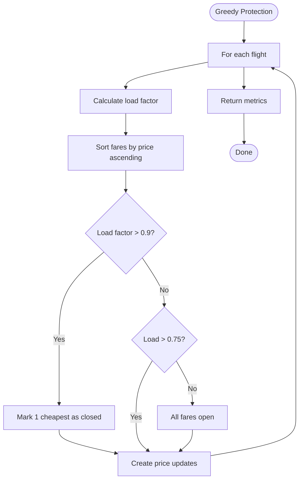

# Algorithm: `greedy_protection`

**Family:** Greedy  
**Purpose:** Protect high-revenue classes by progressively closing cheaper classes as load factor rises.

## Purpose

As a flight fills up, accepting low-yield bookings wastes seat capacity. Greedy protection closes cheaper fare classes in a waterfall as occupancy rises, forcing late bookings into higher-revenue classes. Example: at 90% load, close Economy; at 75%, accept all.

## Inputs / Outputs

| Item | Type |
|------|------|
| **Input** | Fare classes, load factor |
| **Output** | Price updates (closed classes set to very high price) |
| **Output** | `metrics.faresProtected` | Count of price increases |

## Pseudocode

```
FUNCTION greedy_protection_execute(context):
  fareClasses := context.getFareClasses()
  inventory := context.getInventory()
  updates := []
  
  for each flight in context.flightIds():
    fares := fareClasses[flight]
    inv := inventory[flight]
    
    loadFactor := (inv.seatsTotal - inv.seatsLeft) / inv.seatsTotal
    
    // Sort by price ascending (cheap first)
    fares.sort_by(currentPrice, ascending)
    
    // Determine protection threshold
    classesToClose := 0
    if loadFactor > 0.90:
      classesToClose := 1  // Close cheapest
    elif loadFactor > 0.75:
      classesToClose := 0  // Accept all
    
    for i in range(classesToClose):
      fareClass := fares[i]
      newPrice := 99999.99  // Effectively close
      
      if fareClass.currentPrice != newPrice:
        updates.append({
          flightId: flight,
          oldPrice: fareClass.currentPrice,
          newPrice: newPrice,
          fareClassCode: fareClass.code
        })
  
  RETURN {
    status: "SUCCESS",
    priceUpdates: updates,
    metrics: {
      faresProtected: len(updates)
    }
  }
```

## Mermaid Flowchart



## Complexity Analysis

- **Time:** O(F·C·log C) where F = flights, C = classes. Sorting dominates.
- **Space:** O(U) where U = price updates.

## Design Rationale

Waterfall protection mirrors airline revenue management practice. Thresholds (75%, 90%) are heuristic; real airlines use sophisticated models. Alternatives: bid-price allocation (DP-based), dynamic adjustment per time-to-departure.

## Implementation

**Class:** `com.bookero.algorithms.GreedyProtectionAlgorithm`

## Tests

**Test class:** `AlgorithmSmokeTests`

## Performance Results

| Metric | Benchmark (ms) | Low Load (w3-w7) | High Load (w7-w9) |
|--------|---:|---:|---:|
| Duration | 5 (median) | 4 | 4 |
| Duration range | 3-6 ms | N/A | N/A |
| Fares moved | 4 | 0 | 35 |
| Revenue (absolute) | N/A | 2,585,148.60 | 3,377,633.30 |
| Revenue delta | N/A | 0.00% | -0.50% |
| Load factor | 45.4% | 65.1% | 82.3% |
| Avg fare | 448.26 | 439.05 | 453.80 |
| Seats sold | 4,110 | 5,888 | 7,443 |
| Closure thresholds | N/A | [0.55, 0.75, 0.9] | [0.55, 0.75, 0.9] |
| Classes closed | 0-1 | 0 | 1 |

**Critical Finding:**
- At low load (w3-w7): Thresholds never trigger; algorithm is inert; revenue delta 0.00%.
- At high load (w7-w9): One class closes; algorithm engages minimally; revenue delta -0.50%.
- Threshold design (55%, 75%, 90%) is too coarse; flight load factors do not align with thresholds precisely.
- Despite moving 35 fares at high load, revenue impact is negative (-0.50%), suggesting class closures are poorly timed or misjudged.
- Conclusion: Greedy protection without demand signal or adaptive thresholds underperforms. Better to use load-based adjustments with finer granularity or explicit demand forecast.
