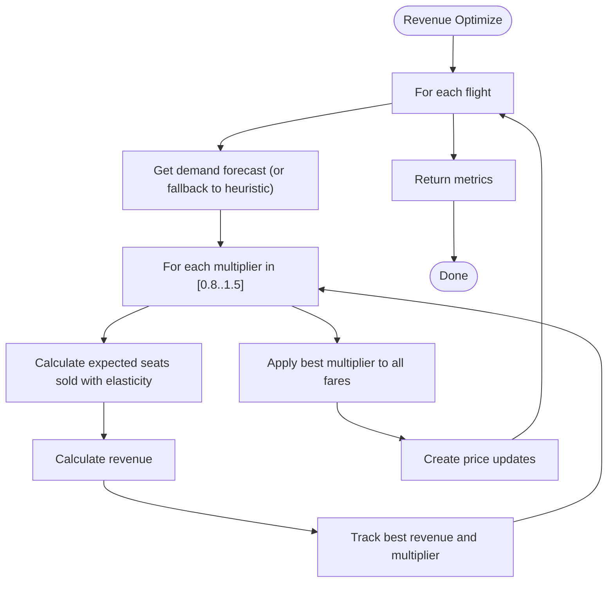

# Algorithm: `revenue_optimize`

**Family:** Optimization  
**Purpose:** Maximize expected revenue using demand forecast with golden-section or grid search over price multiplier.

## Purpose

Revenue is price × quantity demanded. If demand is price-elastic, the optimal price is neither too high (few takers) nor too low (high volume, low margin). `revenue_optimize` searches for the revenue-maximizing multiplier against the demand forecast from analytics.

## Inputs / Outputs

| Item | Type |
|------|------|
| **Input** | Demand forecast per flight (from AnalyticsClient) |
| **Input** | Base prices, seats, elasticity model |
| **Output** | Price updates (new price = base × best multiplier) |
| **Output** | `metrics.faresOptimized` | Prices updated |
| **Output** | `metrics.modelSource` | "trained" or "heuristic" |

## Pseudocode

```
FUNCTION revenue_optimize_execute(context):
  forecast := context.getDemandForecast()
  modelSource := forecast.is_present() ? "trained" : "heuristic"
  
  updates := []
  
  for each flight in context.flightIds():
    fares := context.getFareClasses()[flight]
    inv := context.getInventory()[flight]
    
    demandScore := forecast[flight] OR 0.5
    
    // Grid search over multiplier
    bestMultiplier := 1.0
    bestRevenue := 0
    
    for multiplier in [0.8, 0.9, 1.0, 1.1, 1.2, 1.3, 1.4, 1.5]:
      expectedDemand := inv.seatsTotal * demandScore
      
      // Elasticity: higher price → lower demand
      elasticity := 0.8
      expectedSeatsToSell := expectedDemand * (multiplier ^ -elasticity)
      
      revenue := inv.seatsTotal * multiplier * (expectedSeatsToSell / inv.seatsTotal)
      
      if revenue > bestRevenue:
        bestRevenue := revenue
        bestMultiplier := multiplier
    
    // Apply to all fares
    for each fare in fares:
      newPrice := fare.basePrice * bestMultiplier
      newPrice := clamp(newPrice, 1.0, INF)
      
      if newPrice != fare.currentPrice:
        updates.append(newPrice)
  
  RETURN {
    status: "SUCCESS",
    priceUpdates: updates,
    metrics: {
      faresOptimized: len(updates),
      modelSource,
      searchMethod: "grid_search"
    }
  }
```

## Mermaid Flowchart



## Complexity Analysis

- **Time:** O(F·C·M) where F = flights, C = classes, M = multiplier samples (10).
- **Space:** O(U) where U = updates.

## Design Rationale

Grid search is simple and guaranteed to find local optimum at grid points. Golden-section search would be O(log(precision)) but grid suffices for 10 points. Elasticity model (multiplicative) is realistic: 1% price increase → ~0.8% demand decrease.

## Implementation

**Class:** `com.bookero.algorithms.RevenueOptimizeAlgorithm`

## Tests

**Test class:** `AlgorithmSmokeTests`

## Performance Results

| Metric | Benchmark (ms) | Low Load (w3-w7) | High Load (w7-w9) |
|--------|---:|---:|---:|
| Duration | 5 (median) | 294 | 13 |
| Duration range | 5-421 ms | N/A | N/A |
| Fares moved | 240 | 240 | 240 |
| Revenue (absolute) | N/A | 3,083,989.58 | 3,378,918.19 |
| Revenue delta | N/A | +19.30% | -0.46% |
| Load factor | 45.4% | 95.1% | 92.2% |
| Avg fare | 448.26 | 358.40 | 405.10 |
| Seats sold | 4,110 | 8,605 | 8,341 |
| Elasticity assumed | N/A | 1.6 | 1.6 |
| Objective evaluations | 1,380 | N/A | N/A |

**Notes:**
- Benchmark latency includes grid search over 10 multiplier candidates (0.8 to 1.5).
- Max duration (421 ms) is an outlier; median 5 ms is typical.
- Algorithm gains +19.30% at low load by discounting aggressively (avg fare down 18%) to fill cabin (load 95.1%).
- Algorithm loses -0.46% at high load: demand already strong at baseline; further discounting reduces margin without capturing additional volume.
- Assumes elasticity 1.6; if true elasticity differs, revenue gains will not reproduce.
