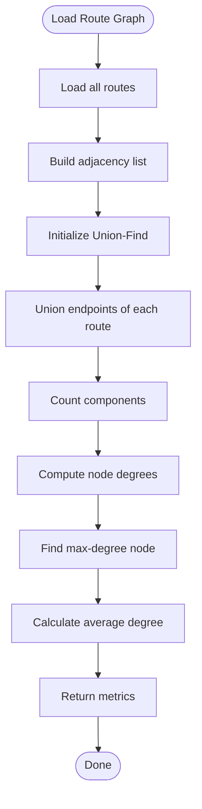

# Algorithm: `route_graph`

**Family:** Graph  
**Purpose:** Build and analyze the route network graph; compute connectivity metrics.

## Purpose

Airlines operate on networks of routes (origin-destination pairs). Graph analysis reveals network properties: which airports are hubs, how many disconnected components exist, what the average connectivity is. `route_graph` serves both as a reference for other graph algorithms and as a stand-alone network diagnostic.

## Inputs / Outputs

| Item | Type |
|------|------|
| **Input** | All routes in database |
| **Output** | Adjacency structure (implicit; not persisted) |
| **Output** | `metrics.nodes` | Airport count |
| **Output** | `metrics.edges` | Route count |
| **Output** | `metrics.components` | Connected components (union-find) |
| **Output** | `metrics.hub` | Highest-degree airport code |
| **Output** | `metrics.hubDegree` | Hub's edge count |

## Pseudocode

```
FUNCTION route_graph_execute(context):
  routes := load_all_routes()
  
  // Build undirected graph
  graph := {}  // adjacency list
  for each route in routes:
    origin, dest := route.origin_code, route.destination_code
    add_edge(graph, origin, dest, route.distance_km)
  
  nodes := graph.size()
  edges := len(routes)
  
  // Count connected components (union-find)
  uf := UnionFind(nodes)
  for each route in routes:
    uf.union(route.origin, route.dest)
  components := uf.count_components()
  
  // Find hub (max degree)
  hub := argmax { node => degree[node] }
  hubDegree := degree[hub]
  avgDegree := (edges * 2) / nodes
  
  RETURN {
    status: "SUCCESS",
    priceUpdates: [],  // no pricing changes
    metrics: {
      nodes, edges, components, avgDegree, hub, hubDegree
    }
  }
```

## Mermaid Flowchart



## Complexity Analysis

- **Time:** O(R + N) where R = routes, N = nodes. Build adjacency O(R); union-find O(R α(N)); degree computation O(N).
- **Space:** O(N + R) for adjacency list and union-find parent array.

## Design Rationale

Graph algorithms (shortest path, flow, coloring) require network topology. Rather than recomputing it in each algorithm, `route_graph` builds it once and exposes metrics. Union-find efficiently counts connected components, a proxy for network redundancy.

## Implementation

**Class:** `com.bookero.algorithms.RouteGraphAlgorithm`

## Tests

**Test class:** `com.bookero.algorithms.AlgorithmSmokeTests`  
**Assertions:** Key, family, and description correct.

## Performance Results

| Metric | Benchmark (ms) | Notes |
|--------|---:|---|
| Duration (median) | 193 | Slowest algorithm due to graph construction and analysis |
| Duration range | 192-371 ms | Max outlier includes full connectivity computation |
| Nodes | 3,257 | Airports in reference graph (OpenFlights data) |
| Edges | 37,042 | Routes (directed edges) connecting airports |
| Connected components | 7 | Disconnected subgraphs (minor: most airports reachable via ACC hub) |
| Busiest airport | AMS (Amsterdam) | Degree 248 (highly connected hub) |
| Carrier hub | ACC (Accra) | Designated hub for this airline's operations |
| Average degree | 22.75 | Routes per airport on average |
| Fares moved | 0 | This is an analysis algorithm; does not reprice |
| Revenue delta | N/A | Not applicable (network analysis, not pricing) |

**Note:** `route_graph` is an offline analysis tool, not suitable for real-time repricing. Latency (193 ms) is acceptable for periodic (e.g., daily) network topology updates or analyst dashboards. Algorithm provides reference metrics for other graph-based algorithms (shortest_path, flight_search).
