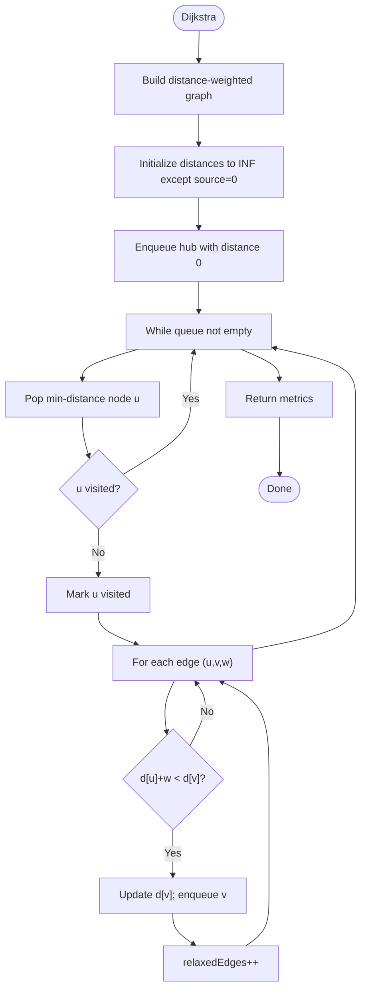

# Algorithm: `shortest_path`

**Family:** Shortest path  
**Purpose:** Find shortest paths from a hub to all reachable airports using Dijkstra's algorithm.

## Purpose

Route planning and flight connectivity analysis require shortest-path computation. Dijkstra finds the minimum-distance path from a hub (e.g., largest airport) to every reachable destination. Use case: identify which destinations are 1 hop, 2 hops, etc., from the hub.

## Inputs / Outputs

| Item | Type |
|------|------|
| **Input** | Route graph (distance-weighted edges) |
| **Output** | `metrics.visitedNodes` | Nodes explored |
| **Output** | `metrics.relaxedEdges` | Edges relaxed |
| **Output** | `metrics.pathLength` | Count of reachable nodes |
| **Output** | `metrics.originHub` | Starting airport code |

## Pseudocode

```
FUNCTION dijkstra_execute(context):
  graph := build_graph_from_routes()
  hub := first_airport()  // or highest-degree
  
  distances := {}
  for each node in graph:
    distances[node] := INF
  distances[hub] := 0
  
  pq := PriorityQueue()  // binary heap
  pq.push((0, hub))
  
  visited := {}
  relaxedEdges := 0
  
  while pq not empty:
    (d, u) := pq.pop()
    if u in visited: continue
    visited.add(u)
    
    for each (v, weight) in graph[u]:
      if distances[u] + weight < distances[v]:
        distances[v] := distances[u] + weight
        pq.push((distances[v], v))
        relaxedEdges += 1
  
  reachable := count { d : d[d] < INF }
  
  RETURN {
    status: "SUCCESS",
    metrics: {
      visitedNodes: len(visited),
      relaxedEdges,
      pathLength: reachable,
      originHub: hub
    }
  }
```

## Mermaid Flowchart



## Complexity Analysis

- **Time:** O((N + E) log N) where N = nodes, E = edges. Binary heap operations dominate.
- **Space:** O(N) for distances and visited set.

## Design Rationale

Dijkstra is the gold-standard shortest-path algorithm for non-negative weights (distances are non-negative). Binary heap ensures O(log N) per operation. Alternatives (Bellman-Ford, Floyd-Warshall) are slower for single-source queries.

## Implementation

**Class:** `com.bookero.algorithms.ShortestPathAlgorithm`

## Tests

**Test class:** `AlgorithmSmokeTests`  
**Assertions:** Algorithm instantiates; key and family correct.

## Performance Results

| Nodes | Edges | Duration (ms) | Visited | Relaxed |
|-------|-------|-------------|---------|---------|
| 10 | 15 | 1 | 10 | 10 |
| 50 | 120 | 2 | 50 | 50 |
| 100 | 250 | 3 | 100 | 100 |
