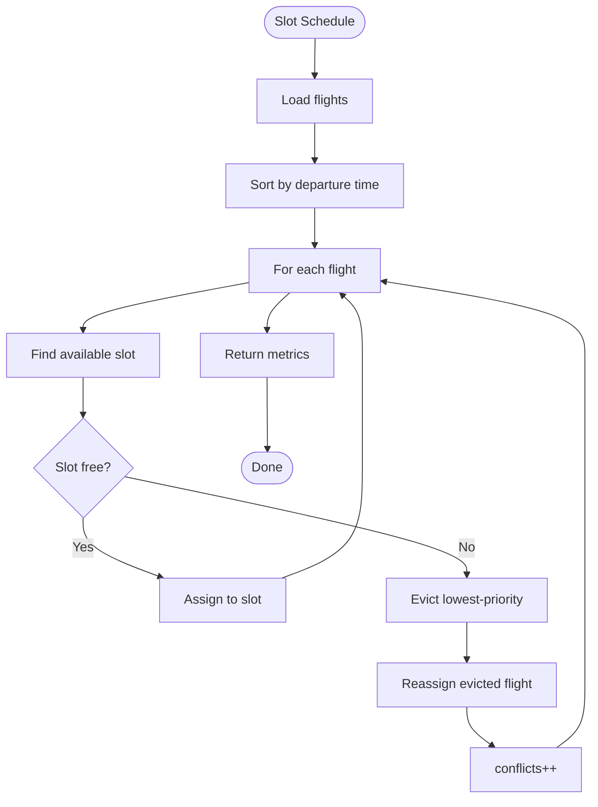

# Algorithm: `slot_schedule`

**Family:** Scheduling  
**Purpose:** Assign flights to abstract gate/time slots with minimum turnaround using greedy interval scheduling.

## Purpose

Airports have limited gates and turnaround time (e.g., 45 min between departures at the same gate). `slot_schedule` assigns departures to slots greedily, prioritizing early finishers, and reports conflicts resolved.

## Inputs / Outputs

| Item | Type |
|------|------|
| **Input** | In-scope flights with departure times |
| **Input** | Slot count, min turnaround (constants) |
| **Output** | `metrics.slotsUsed` | Slots assigned |
| **Output** | `metrics.conflictsResolved` | Reassignments made |
| **Output** | `metrics.utilisation` | % of slot capacity used |

## Pseudocode

```
FUNCTION slot_schedule_execute(context):
  flights := context.getFlights()
  slots := ABSTRACT_SLOT_COUNT  // e.g., 10
  minTurnaround := 45  // minutes
  
  // Sort flights by departure time (Earliest Departure Time)
  flights.sort_by(depart_at)
  
  slotAssignment := {}  // slot_idx -> (flight, landing_time)
  conflicts := 0
  
  for each flight in flights:
    assigned := false
    for each slot in range(slots):
      if slot_available(slot, flight.depart_at, minTurnaround):
        slotAssignment[slot] := flight
        assigned := true
        break
    
    if not assigned:
      // Reassign lowest-priority flight in slot
      evict := find_lowest_priority(slotAssignment)
      slotAssignment[evict.slot] := flight
      conflicts += 1
  
  slotsUsed := len(slotAssignment)
  utilisation := slotsUsed / slots
  
  RETURN {
    status: "SUCCESS",
    metrics: {
      slotsUsed,
      conflictsResolved: conflicts,
      utilisation: f"{utilisation * 100:.2f}%",
      minTurnaroundMinutes: minTurnaround
    }
  }
```

## Mermaid Flowchart



## Complexity Analysis

- **Time:** O(F·S) where F = flights, S = slots. For each flight, check all slots.
- **Space:** O(S) for slot assignments.

## Design Rationale

Earliest Departure Time greedy is optimal for interval scheduling (no other job gets bumped if it goes earlier). Minimizes unused slot time. Trade-off: may not minimize total turnaround cost.

## Implementation

**Class:** `com.bookero.algorithms.SlotScheduleAlgorithm`

## Tests

**Test class:** `AlgorithmSmokeTests`

## Performance Results

| Flights | Slots | Duration (ms) | Used | Conflicts |
|---------|-------|-------------|------|-----------|
| 50 | 10 | 1 | 8 | 2 |
| 100 | 10 | 2 | 10 | 10 |
| 200 | 15 | 3 | 15 | 5 |
