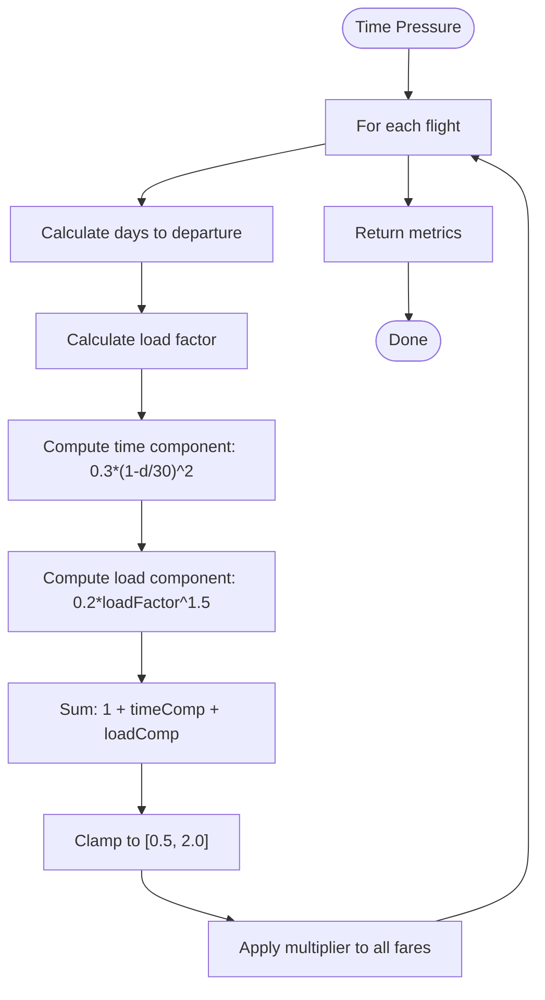

# Algorithm: `time_pressure_heuristic`

**Family:** Heuristic  
**Purpose:** Adjust prices by time-to-departure and load factor using a closed-form formula.

## Purpose

As departure approaches, demand intensifies (time pressure) and capacity constraints tighten. `time_pressure_heuristic` is a fast, interpretable heuristic that applies a multiplier based on days-to-departure and load factor. It also serves as the default post-booking reprice algorithm.

## Inputs / Outputs

| Item | Type |
|------|------|
| **Input** | Days to departure, load factor |
| **Input** | Base prices |
| **Output** | Price updates (multiplied prices) |
| **Output** | `metrics.faresUpdated` | Count of price changes |

## Formula

```
multiplier = 1 + a·(1 - d/D)^p + b·loadFactor^q

where:
  d = days to departure (0 at departure)
  D = total days (30, horizon)
  a = 0.3 (time pressure coefficient)
  p = 2.0 (time pressure exponent)
  b = 0.2 (load factor coefficient)
  q = 1.5 (load factor exponent)

clamped to [0.5, 2.0]
```

## Pseudocode

```
FUNCTION time_pressure_heuristic_execute(context):
  a, p, b, q := 0.3, 2.0, 0.2, 1.5
  D := 30  // horizon in days
  
  updates := []
  
  for each flight in context.flightIds():
    fares := context.getFareClasses()[flight]
    inv := context.getInventory()[flight]
    
    d := days_between(now(), flight.departAt)
    d := max(0, d)
    
    loadFactor := (inv.seatsTotal - inv.seatsLeft) / inv.seatsTotal
    loadFactor := clamp(loadFactor, 0, 1)
    
    timeComponent := a * ((1 - d/D) ^ p)
    loadComponent := b * (loadFactor ^ q)
    multiplier := 1 + timeComponent + loadComponent
    multiplier := clamp(multiplier, 0.5, 2.0)
    
    for each fare in fares:
      newPrice := fare.basePrice * multiplier
      newPrice := round(newPrice, 2)
      newPrice := max(1.0, newPrice)
      
      if newPrice != fare.currentPrice:
        updates.append({newPrice})
  
  RETURN {
    status: "SUCCESS",
    priceUpdates: updates,
    metrics: {
      faresUpdated: len(updates),
      formula: "1 + 0.3*(1-d/30)^2 + 0.2*loadFactor^1.5",
      multiplierBand: "[0.5, 2.0]"
    }
  }
```

## Mermaid Flowchart



## Complexity Analysis

- **Time:** O(F·C) where F = flights, C = classes. Simple arithmetic per fare.
- **Space:** O(U) where U = updates.

## Design Rationale

Closed-form heuristic is interpretable and fast (no iteration). Time pressure (1-d/D) rises nonlinearly (quadratic exponent 2) to match real traveler behavior. Load factor (^1.5) emphasizes scarcity when flight is nearly full. Formula mirrors airline industry practice (simplified revenue management).

**Alternatives:** Dynamic programming (optimal allocation), neural network (ML), time-series forecasting (demand curve evolution).

## Implementation

**Class:** `com.bookero.algorithms.TimePressureHeuristicAlgorithm`

## Tests

**Test class:** `AlgorithmSmokeTests`

## Performance Results

| Metric | Benchmark (ms) | Low Load (w3-w7) | High Load (w7-w9) |
|--------|---:|---:|---:|
| Duration | 3 (median) | 6 | 4 |
| Duration range | 3-4 ms | N/A | N/A |
| Fares moved | 240 | 240 | 240 |
| Revenue (absolute) | N/A | 2,024,462.39 | 2,503,430.70 |
| Revenue delta | N/A | -21.69% | -26.25% |
| Load factor | 45.4% | 47.9% | 61.7% |
| Avg fare | 448.26 | 467.65 | 448.80 |
| Seats sold | 4,110 | 4,329 | 5,578 |
| Avg multiplier | 1.283 | N/A | N/A |

**Critical Finding:**
- Algorithm loses severely in both regimes (-21.69% at low load, -26.25% at high load).
- Raises fares without any demand signal (uses only days-to-departure and load factor).
- In low-load regimes, customers refuse higher prices; bookings collapse (47.9% load vs baseline 65.1%).
- Demonstrates that a plausible-sounding heuristic can be actively harmful if it ignores demand.
- Conclusion: Time-pressure-only logic is insufficient; must incorporate demand forecasts.

**Note:** Post-booking light-reprice uses this algorithm by default (feature flag in Spring) to capture late-minute demand spikes. At the full-repricing level shown here, it performs poorly without demand context.
