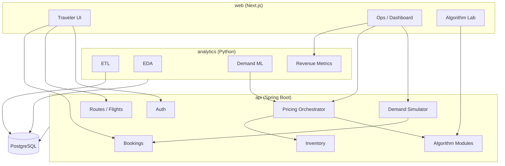
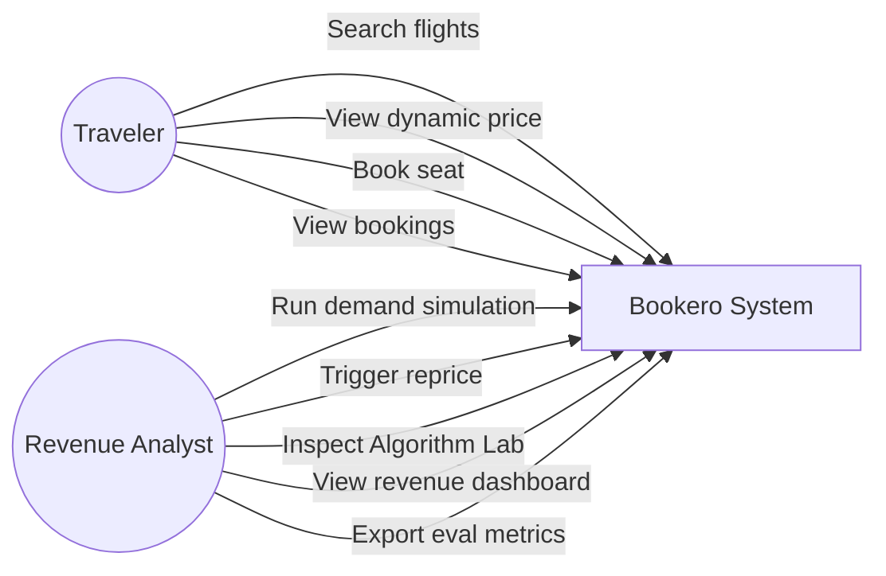
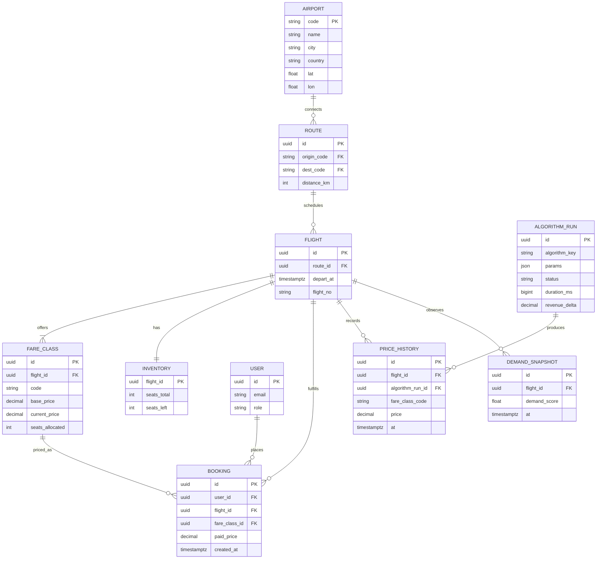
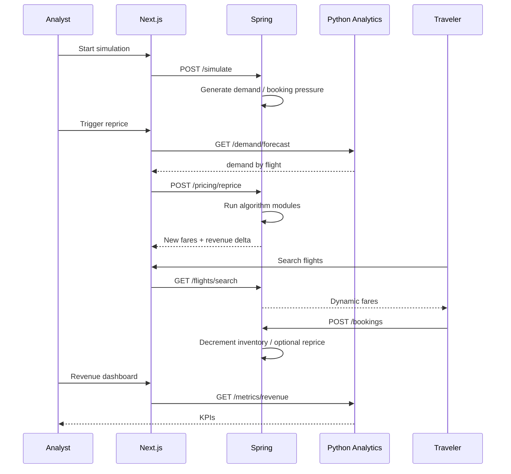
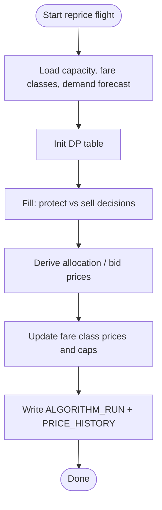

# Bookero — Design Spec

**Date:** 2026-07-28  
**Course topic:** #66 Dynamic Pricing Algorithm for Airlines  
**Product:** Bookero — single-airline dynamic pricing, booking, and revenue analytics  
**Approach:** Simulation-first + Algorithm Lab (Approach 3)  
**Eval window:** ~10–15 August 2026  

This document is the approved design. The Claude Code–executable build bible derived from it is `BUILD.md` at the repo root (created in the implementation-plan step).

---

## 1. Problem statement

Airlines must set fares under limited seat capacity, uncertain demand, time-to-departure pressure, and revenue goals. Static pricing leaves money on the table or sells out too early. **Bookero** is a revenue-management web system that:

1. Loads a real-world airport/route backbone (public data).
2. Simulates booking demand against a flagship carrier’s inventory.
3. Reprices fare classes with explicit algorithms (greedy, DP, heuristics, ML-informed optimization, graph/search/scheduling where they fit the airline domain).
4. Lets travelers search and book at live dynamic prices.
5. Shows analysts revenue analytics and an Algorithm Lab for comparison and Phase-4 evidence.

### Computational Thinking pillars

| Pillar | Bookero expression |
|--------|-------------------|
| **Decomposition** | Modules: routes, inventory, bookings, simulation, pricing, algorithms, analytics, web roles |
| **Pattern Recognition** | EDA on demand/bookings; dashboards; demand ML insights |
| **Abstraction** | UML/Mermaid, ER, API contracts, fare-class and bid-price models |
| **Algorithmic Thinking** | Full algorithm pack: description, pseudocode, flowchart, implementation, tests, performance |

---

## 2. Locked decisions

| Decision | Choice |
|----------|--------|
| Product model | Single airline revenue-management suite (not OTA) |
| App surface | **Next.js web only** (traveler + ops + Algorithm Lab, role-based). React Native = out of MVP |
| Backend | Spring Boot API |
| Analytics | Python (Pandas, NumPy, scikit-learn; PyTorch optional for demand model). TensorFlow/Tableau/Power BI = stretch |
| Database | **PostgreSQL only** |
| Data | Public flight/route datasets + synthetic bookings/prices |
| Architecture style | Simulation-first; Algorithm Lab calls the **same** code as live reprice |
| Deploy | Docker Compose default; cloud (AWS/GCP/Heroku) stretch |
| Algorithm coverage | Maximum coherent checklist (every listed family mapped into one product) |
| Demo | Full loop: simulate → reprice → traveler books → dashboard updates |

### Recommended stack (course) vs MVP

Course lists options. MVP uses: **Next.js + Spring + PostgreSQL + Python analytics + Docker**. Mobile, MongoDB, Supabase, Tableau/Power BI are optional/stretch unless time remains.

---

## 3. Engineering standards (non-negotiable)

Claude Code / any implementer MUST follow:

1. **Senior-level code quality** — clear boundaries, no dead code, no copy-paste modules, sensible complexity, indexed DB access, batched writes where needed, avoid N+1, prefer streaming/pagination for large lists, cache read-heavy reference data (airports/routes) thoughtfully.
2. **Optimize for correctness first, then measurable performance** — every algorithm reports latency; hot paths profiled under seed load; no premature micro-optimizations that hurt clarity.
3. **Sparse comments** — comment only non-obvious invariants, trade-offs, or formula sources. No narrating what the next line does. Prefer expressive names and small functions.
4. **Conventional commits, one file per commit** — after each meaningful file is complete and builds/tests for that unit pass:
   - `feat(api): add Inventory entity`
   - `fix(pricing): prevent oversell race`
   - `docs(algorithms): add dp seat-protection pseudocode`
   - `test(analytics): demand model smoke`
   - `chore(docker): add postgres service`  
   Do not batch unrelated files into one commit.

---

## 4. Architecture

### Runtime services

| Service | Tech | Role |
|---------|------|------|
| `postgres` | PostgreSQL 16 | System of record |
| `api` | Spring Boot 3.x | Domain API, simulation, pricing orchestration, algorithms |
| `analytics` | Python FastAPI | ETL, EDA, demand ML, revenue metrics |
| `web` | Next.js (App Router) | Traveler + Analyst UIs |



### High-level data flow

```
OpenFlights (airports/routes)
    → Python ETL → PostgreSQL
    → Seed flights / fare classes / inventory
    → Demand Simulator → bookings + DEMAND_SNAPSHOT
    → Demand ML forecast
    → Pricing algorithms → fare updates + PRICE_HISTORY + ALGORITHM_RUN
    → Traveler search/book + Ops dashboard + Algorithm Lab
```

---

## 5. Actors, use cases, decomposition

**Actors:** Traveler, Revenue Analyst, System (simulator).



### Web areas

1. **Traveler** — search, dynamic fare, book, history  
2. **Ops** — inventory, simulate, reprice, revenue dashboard  
3. **Algorithm Lab** — per-algorithm docs link, run, compare vs baseline, latency/revenue  
4. **Auth** — roles `TRAVELER` | `ANALYST` (JWT from Spring)

### Spring packages (suggested)

`auth`, `airport`, `route`, `flight`, `inventory`, `booking`, `simulation`, `pricing`, `algorithms`, `common`

### Python packages

`etl`, `eda`, `demand`, `metrics`, `api`

---

## 6. Data model



**Integrity rules:** booking decrements `seats_left` in a transaction; refuse oversell with HTTP 409; price updates append `PRICE_HISTORY` (never silent overwrite without history).

---

## 7. API sketch (Spring)

| Method | Path | Role | Purpose |
|--------|------|------|---------|
| POST | `/api/auth/login` | public | JWT |
| GET | `/api/flights/search` | traveler+ | origin, dest, date |
| GET | `/api/flights/{id}` | traveler+ | detail + fare classes |
| POST | `/api/bookings` | traveler | create booking |
| GET | `/api/bookings/me` | traveler | history |
| POST | `/api/simulate` | analyst | run demand simulation |
| POST | `/api/pricing/reprice` | analyst | body: `algorithmKey`, `flightIds?` |
| GET | `/api/algorithms` | analyst | catalog |
| POST | `/api/algorithms/{key}/run` | analyst | Lab run (same impl as reprice) |
| GET | `/api/algorithms/runs` | analyst | history |

### Analytics (Python)

| Method | Path | Purpose |
|--------|------|---------|
| POST | `/etl/run` | ingest OpenFlights → DB |
| GET | `/eda/summary` | statistical summaries |
| POST | `/demand/train` | fit demand model |
| GET | `/demand/forecast` | per-flight scores |
| GET | `/metrics/revenue` | KPIs for dashboard |

---

## 8. Algorithmic Thinking pack (Phase 4)

Every algorithm below MUST ship with:

1. Description + complexity in `docs/algorithms/<key>.md`  
2. Pseudocode (same file)  
3. Mermaid flowchart (same file)  
4. Implementation (Spring and/or Python — Lab + live path share it)  
5. Unit/integration tests  
6. Performance evaluation (latency ms, revenue vs baseline, load-factor impact) recorded in Lab + `docs/05-evaluation.md`

### Mapping (coherent, not grab-bag)

| Key | Family | Bookero use |
|-----|--------|-------------|
| `route_graph` | Graph | Build airport/route weighted graph |
| `shortest_path` | Shortest path | Connection search (Dijkstra; A* stretch) |
| `flight_search` | Search | Priority/BFS-style itinerary expansion under constraints |
| `slot_schedule` | Scheduling | Greedy/heuristic departure slot / turnaround assignment for seeded fleet |
| `greedy_protection` | Greedy | Protect high fare classes as seats sell |
| `dp_seat_protect` | DP | Optimal multi-class seat allocation / bid prices |
| `revenue_optimize` | Optimization | Maximize expected revenue under capacity (uses demand forecast) |
| `time_pressure_heuristic` | Heuristic | Markup/markdown from days-to-departure + load factor |
| `demand_ml` | ML pipeline | Train/predict demand → feeds `revenue_optimize` / reprice |

**Baseline:** fixed `base_price` with no dynamic adjustment — all Lab runs compare against baseline.

### Shared run sequence



### Example flowchart — `dp_seat_protect`



---

## 9. Project Delivery Framework (mandatory)

| Phase | Deliverable | Concrete path / feature |
|-------|-------------|-------------------------|
| 1. Problem Framing | Problem × CT pillars | `docs/01-problem-framing.md` |
| 2. System Design | Architecture + abstraction | `docs/02-system-design.md` (all Mermaid) |
| 3. App Development | Functional MVP (web) | `apps/web` + `services/api` via Compose |
| 4. Data Pipeline | ETL + analytics dashboard | `services/analytics` ETL + Ops dashboard |
| 5. Evaluation | Metrics + user testing | Algorithm Lab + `docs/05-evaluation.md` + `docs/user-testing.md` |
| 6. Documentation | Tech report / paper format | `docs/06-technical-report.md` |

**Build order:** Phase 1 → 2 → scaffold → Phase 4 ETL/seed → Phase 3 MVP paths → Phase 4 algorithms (full AT pack) → Phase 5 → Phase 6 (fill from real runs).

---

## 10. Error handling

| Case | Behavior |
|------|----------|
| Oversell | Transaction rollback, HTTP 409, clear message |
| Algorithm failure | Keep last good prices; `ALGORITHM_RUN.status=FAILED`; surface error in Lab |
| Analytics down | Booking/pricing still work; dashboard shows stale/unavailable banner |
| Validation | HTTP 400 with field errors |
| AuthZ | Travelers blocked from ops/lab/simulate/reprice |

---

## 11. Testing & evaluation metrics

**Tests**

- Spring: per-algorithm unit tests; booking/inventory concurrency/oversell test  
- Python: ETL schema/row tests; demand model smoke (fit synthetic → predict)  
- Web: manual checklist mandatory; E2E optional if time  

**Metrics (UI + docs)**

- Total revenue, revenue vs baseline, load factor, average fare  
- Forecast MAE/RMSE (when ML trained)  
- Algorithm latency (ms)  
- User testing: 3–5 scripted tasks + short feedback (`docs/user-testing.md`)

---

## 12. Repository layout

```
bookero/
  CLAUDE.md
  BUILD.md
  docker-compose.yml
  apps/web/
  services/api/
  services/analytics/
  docs/
    01-problem-framing.md
    02-system-design.md
    05-evaluation.md
    06-technical-report.md
    algorithms/
    user-testing.md
  data/raw/
  data/processed/
  scripts/seed.sh
  scripts/demo-walkthrough.md
```

---

## 13. Demo script (eval day, 5–7 min)

1. Open Ops as Analyst — show empty/baseline revenue.  
2. Run ETL status / show seeded network map or route table.  
3. Run demand simulation.  
4. Open Algorithm Lab — run baseline vs `dp_seat_protect` vs `greedy_protection` — show latency + revenue delta.  
5. Switch to Traveler — search hub route — show live fare — book.  
6. Return to dashboard — inventory and revenue updated.  
7. Point evaluators at `docs/` Phases 1–6 + algorithm Mermaid/pseudocode.

---

## 14. Out of scope (MVP)

- React Native / mobile  
- MongoDB, Supabase  
- Live GDS / real-time airline fare APIs  
- Real payments / PCI  
- Tableau/Power BI (optional CSV export = stretch)  
- Production multi-tenant cloud HA  

---

## 15. Success criteria

- `docker compose up` brings Postgres, API, analytics, web to a usable state.  
- Full-loop demo works without manual SQL.  
- Every algorithm family in §8 has docs (pseudo + Mermaid), implementation, tests, and recorded performance.  
- Phases 1–6 artifacts exist and match the running system.  
- Code meets §3 standards (quality, sparse comments, per-file conventional commits).

---

## 16. Next step

After user approval of this written spec → write implementation plan (`writing-plans`) → produce root `BUILD.md` + `CLAUDE.md` for Claude Code execution.
